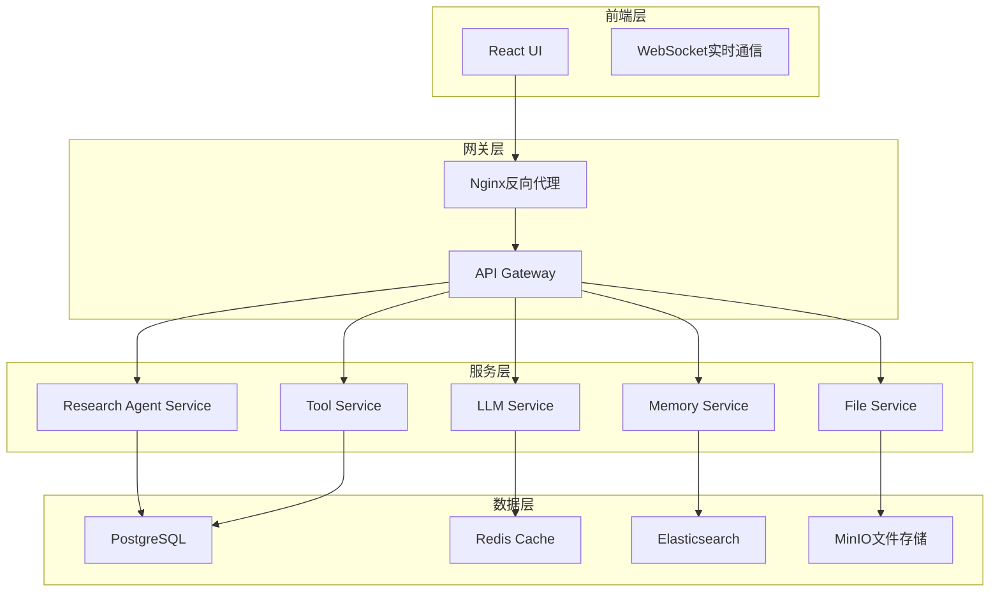

 # Coco AI DeepResearch 功能落地实现方案

## 一、项目背景与目标

### 1.1 项目背景
Coco AI公司需要开发一个基于深度研究的智能体系统，参考京东开源的JoyAgent-JDGenie项目架构，实现一个端到端的多智能体研究平台。

### 1.2 项目目标
- 构建一个开箱即用的深度研究智能体系统
- 支持多种研究场景：市场分析、技术调研、竞品分析等
- 提供多种输出格式：HTML报告、PPT演示、Markdown文档
- 实现可插拔的工具生态和智能体扩展机制

## 二、技术架构设计

### 2.1 整体架构



### 2.2 核心组件设计

#### 2.2.1 Research Agent Service
- **功能**: 核心研究智能体，负责任务规划、执行和结果生成
- **技术栈**: Go + Gin + GORM
- **核心特性**:
  - 多模式智能体：React模式、Plan-and-Execute模式
  - 并发工具执行引擎
  - 上下文管理和记忆机制

#### 2.2.2 Tool Service
- **功能**: 工具服务，提供各种研究工具
- **技术栈**: Python + FastAPI + Celery
- **核心工具**:
  - 网络搜索工具
  - 数据分析工具
  - 文档生成工具
  - 代码执行工具

#### 2.2.3 LLM Service
- **功能**: 大语言模型服务，支持多种LLM
- **支持模型**: OpenAI GPT-4、Claude、DeepSeek等
- **特性**: 模型路由、负载均衡、成本控制

#### 2.2.4 Memory Service
- **功能**: 智能体记忆管理
- **存储**: Elasticsearch + Redis
- **特性**: 语义搜索、上下文检索、知识图谱

## 三、核心功能模块

### 3.1 智能体引擎

#### 3.1.1 BaseAgent接口设计
```go
type Agent interface {
    // 运行智能体
    Run(ctx context.Context, query string) (string, error)
    
    // 执行单步
    Step(ctx context.Context) (string, error)
    
    // 更新记忆
    UpdateMemory(role RoleType, content string, args ...interface{}) error
    
    // 执行工具
    ExecuteTool(toolCall *ToolCall) (string, error)
    
    // 获取状态
    GetState() AgentState
    
    // 设置上下文
    SetContext(ctx *AgentContext)
}
```

#### 3.1.2 ResearchAgent实现
```go
type ResearchAgent struct {
    BaseAgent
    researchPlan *ResearchPlan
    dataSources  []DataSource
    outputFormat OutputFormat
}

func (ra *ResearchAgent) Run(ctx context.Context, query string) (string, error) {
    // 1. 分析用户需求
    requirements := ra.analyzeRequirements(query)
    
    // 2. 制定研究计划
    plan := ra.createResearchPlan(requirements)
    
    // 3. 执行研究任务
    results := ra.executeResearch(plan)
    
    // 4. 生成研究报告
    return ra.generateReport(results)
}
```

### 3.2 工具系统

#### 3.2.1 基础工具接口
```go
type Tool interface {
    GetName() string
    GetDescription() string
    GetParameters() map[string]interface{}
    Execute(input interface{}) (interface{}, error)
}
```

#### 3.2.2 核心研究工具

**1. 网络搜索工具**
```go
type WebSearchTool struct {
    searchEngine string
    apiKey       string
}

func (wst *WebSearchTool) Execute(input interface{}) (interface{}, error) {
    query := input.(string)
    results := wst.search(query)
    return wst.processResults(results), nil
}
```

**2. 数据分析工具**
```go
type DataAnalysisTool struct {
    pythonExecutor *PythonExecutor
}

func (dat *DataAnalysisTool) Execute(input interface{}) (interface{}, error) {
    data := input.([]byte)
    analysis := dat.analyze(data)
    return dat.generateInsights(analysis), nil
}
```

**3. 文档生成工具**
```go
type DocumentGenerator struct {
    templateEngine *TemplateEngine
}

func (dg *DocumentGenerator) Execute(input interface{}) (interface{}, error) {
    data := input.(*ResearchData)
    return dg.generateDocument(data), nil
}
```

### 3.3 记忆系统

#### 3.3.1 记忆接口
```go
type Memory interface {
    // 存储记忆
    Store(sessionID string, memory *MemoryItem) error
    
    // 检索记忆
    Retrieve(sessionID string, query string) ([]*MemoryItem, error)
    
    // 更新记忆
    Update(sessionID string, memoryID string, memory *MemoryItem) error
    
    // 删除记忆
    Delete(sessionID string, memoryID string) error
}
```

#### 3.3.2 Elasticsearch记忆实现
```go
type ESMemory struct {
    client *elasticsearch.Client
    index  string
}

func (esm *ESMemory) Store(sessionID string, memory *MemoryItem) error {
    doc := &MemoryDocument{
        SessionID: sessionID,
        Content:   memory.Content,
        Embedding: memory.Embedding,
        Timestamp: time.Now(),
    }
    
    _, err := esm.client.Index(esm.index, doc)
    return err
}
```

## 四、数据模型设计

### 4.1 核心数据表

#### 4.1.1 研究会话表
```sql
CREATE TABLE research_sessions (
    id UUID PRIMARY KEY DEFAULT gen_random_uuid(),
    user_id VARCHAR(50) NOT NULL,
    title VARCHAR(200) NOT NULL,
    description TEXT,
    status VARCHAR(20) DEFAULT 'active',
    created_at TIMESTAMP DEFAULT CURRENT_TIMESTAMP,
    updated_at TIMESTAMP DEFAULT CURRENT_TIMESTAMP
);
```

#### 4.1.2 研究任务表
```sql
CREATE TABLE research_tasks (
    id UUID PRIMARY KEY DEFAULT gen_random_uuid(),
    session_id UUID REFERENCES research_sessions(id),
    task_type VARCHAR(50) NOT NULL,
    title VARCHAR(200) NOT NULL,
    description TEXT,
    status VARCHAR(20) DEFAULT 'pending',
    result TEXT,
    created_at TIMESTAMP DEFAULT CURRENT_TIMESTAMP,
    completed_at TIMESTAMP
);
```

#### 4.1.3 工具调用记录表
```sql
CREATE TABLE tool_calls (
    id UUID PRIMARY KEY DEFAULT gen_random_uuid(),
    task_id UUID REFERENCES research_tasks(id),
    tool_name VARCHAR(100) NOT NULL,
    input_data JSONB,
    output_data JSONB,
    execution_time INTEGER,
    status VARCHAR(20) DEFAULT 'success',
    created_at TIMESTAMP DEFAULT CURRENT_TIMESTAMP
);
```

### 4.2 Elasticsearch索引设计

#### 4.2.1 记忆索引
```json
{
  "mappings": {
    "properties": {
      "session_id": {"type": "keyword"},
      "content": {
        "type": "text",
        "analyzer": "ik_max_word",
        "search_analyzer": "ik_smart"
      },
      "embedding": {"type": "dense_vector", "dims": 1536},
      "timestamp": {"type": "date"},
      "tags": {"type": "keyword"}
    }
  }
}
```

#### 4.2.2 知识库索引
```json
{
  "mappings": {
    "properties": {
      "domain": {"type": "keyword"},
      "title": {"type": "text", "analyzer": "ik_max_word"},
      "content": {"type": "text", "analyzer": "ik_max_word"},
      "embedding": {"type": "dense_vector", "dims": 1536},
      "source": {"type": "keyword"},
      "created_at": {"type": "date"}
    }
  }
}
```

## 五、API设计

### 5.1 RESTful API

#### 5.1.1 研究会话管理
```go
// 创建研究会话
POST /api/v1/research/sessions
{
    "title": "市场分析研究",
    "description": "分析某行业市场趋势",
    "user_id": "user123"
}

// 获取研究会话列表
GET /api/v1/research/sessions?user_id=user123&page=1&size=10

// 获取研究会话详情
GET /api/v1/research/sessions/{session_id}
```

#### 5.1.2 研究任务管理
```go
// 创建研究任务
POST /api/v1/research/sessions/{session_id}/tasks
{
    "task_type": "market_analysis",
    "title": "竞争对手分析",
    "description": "分析主要竞争对手的优势劣势"
}

// 执行研究任务
POST /api/v1/research/tasks/{task_id}/execute

// 获取任务状态
GET /api/v1/research/tasks/{task_id}/status
```

#### 5.1.3 工具管理
```go
// 获取可用工具列表
GET /api/v1/tools

// 执行工具
POST /api/v1/tools/{tool_name}/execute
{
    "input": "搜索关键词",
    "parameters": {}
}
```

### 5.2 WebSocket API

#### 5.2.1 实时通信
```go
// 连接WebSocket
WS /api/v1/ws/research/{session_id}

// 消息格式
{
    "type": "task_update",
    "data": {
        "task_id": "task123",
        "status": "in_progress",
        "progress": 50,
        "message": "正在分析数据..."
    }
}
```

## 六、部署架构

### 6.1 容器化部署

#### 6.1.1 Docker Compose配置
```yaml
version: '3.8'

services:
  research-agent:
    build: ./research-agent
    ports:
      - "8080:8080"
    environment:
      - DB_HOST=postgres
      - REDIS_HOST=redis
      - ES_HOST=elasticsearch
    depends_on:
      - postgres
      - redis
      - elasticsearch

  tool-service:
    build: ./tool-service
    ports:
      - "1601:1601"
    environment:
      - CELERY_BROKER_URL=redis://redis:6379/0
    depends_on:
      - redis

  frontend:
    build: ./frontend
    ports:
      - "3000:3000"
    depends_on:
      - research-agent

  postgres:
    image: postgres:15
    environment:
      POSTGRES_DB: coco_research
      POSTGRES_USER: coco
      POSTGRES_PASSWORD: password
    volumes:
      - postgres_data:/var/lib/postgresql/data

  redis:
    image: redis:7-alpine
    ports:
      - "6379:6379"

  elasticsearch:
    image: elasticsearch:8.11
    environment:
      - discovery.type=single-node
      - xpack.security.enabled=false
    ports:
      - "9200:9200"
    volumes:
      - es_data:/usr/share/elasticsearch/data

volumes:
  postgres_data:
  es_data:
```

### 6.2 Kubernetes部署

#### 6.2.1 命名空间配置
```yaml
apiVersion: v1
kind: Namespace
metadata:
  name: coco-research
```

#### 6.2.2 服务配置
```yaml
apiVersion: apps/v1
kind: Deployment
metadata:
  name: research-agent
  namespace: coco-research
spec:
  replicas: 3
  selector:
    matchLabels:
      app: research-agent
  template:
    metadata:
      labels:
        app: research-agent
    spec:
      containers:
      - name: research-agent
        image: coco/research-agent:latest
        ports:
        - containerPort: 8080
        env:
        - name: DB_HOST
          valueFrom:
            configMapKeyRef:
              name: coco-config
              key: db_host
```

## 七、实施计划

### 7.1 第一阶段：基础架构搭建（2周）

**目标**: 搭建基础开发环境和核心架构

**任务清单**:
- [ ] 项目初始化，创建Go和Python项目结构
- [ ] 数据库设计和初始化
- [ ] Elasticsearch集群部署和配置
- [ ] Redis缓存服务配置
- [ ] 基础中间件开发（日志、配置、监控）
- [ ] CI/CD流水线搭建

**交付物**:
- 基础项目框架
- 数据库表结构
- 基础API接口

### 7.2 第二阶段：核心功能开发（4周）

**目标**: 实现核心智能体和工具功能

**任务清单**:
- [ ] BaseAgent接口设计和实现
- [ ] ResearchAgent核心逻辑开发
- [ ] 工具系统设计和实现
- [ ] 记忆系统开发
- [ ] LLM服务集成
- [ ] 文件服务实现

**交付物**:
- 核心智能体功能
- 基础工具集合
- 记忆管理系统

### 7.3 第三阶段：前端开发（3周）

**目标**: 开发用户界面和交互功能

**任务清单**:
- [ ] React前端项目搭建
- [ ] 研究会话管理界面
- [ ] 实时进度展示
- [ ] 报告查看和下载功能
- [ ] 用户权限管理

**交付物**:
- 完整的前端界面
- 用户交互功能
- 实时通信功能

### 7.4 第四阶段：集成测试和优化（2周）

**目标**: 系统集成测试和性能优化

**任务清单**:
- [ ] 端到端功能测试
- [ ] 性能压测和调优
- [ ] 安全测试和漏洞修复
- [ ] 文档编写
- [ ] 部署脚本优化

**交付物**:
- 测试报告
- 性能优化报告
- 部署文档

### 7.5 第五阶段：上线部署（1周）

**目标**: 生产环境部署和监控

**任务清单**:
- [ ] 生产环境配置
- [ ] 监控告警配置
- [ ] 数据迁移
- [ ] 用户培训
- [ ] 上线验证

**交付物**:
- 生产环境系统
- 监控告警系统
- 用户使用手册

## 八、技术风险与应对策略

### 8.1 技术风险

#### 8.1.1 LLM API稳定性
**风险**: 第三方LLM API可能不稳定或限流
**应对策略**:
- 实现多LLM提供商支持
- 添加重试机制和熔断器
- 本地模型作为备选方案

#### 8.1.2 数据安全
**风险**: 研究数据可能包含敏感信息
**应对策略**:
- 数据加密存储
- 访问权限控制
- 审计日志记录

#### 8.1.3 性能瓶颈
**风险**: 大量并发请求可能导致性能问题
**应对策略**:
- 水平扩展架构
- 缓存策略优化
- 异步处理机制

### 8.2 业务风险

#### 8.2.1 需求变更
**风险**: 业务需求可能频繁变更
**应对策略**:
- 模块化设计
- 配置化功能
- 快速迭代机制

#### 8.2.2 用户接受度
**风险**: 用户可能不接受新的研究方式
**应对策略**:
- 用户调研和反馈
- 渐进式功能发布
- 完善的用户培训

## 九、成本估算

### 9.1 开发成本

| 阶段 | 人力投入 | 时间 | 成本估算 |
|------|----------|------|----------|
| 基础架构 | 2人 | 2周 | 8万元 |
| 核心功能 | 3人 | 4周 | 24万元 |
| 前端开发 | 2人 | 3周 | 12万元 |
| 测试优化 | 2人 | 2周 | 8万元 |
| 上线部署 | 1人 | 1周 | 2万元 |
| **总计** | **10人周** | **12周** | **54万元** |

### 9.2 运维成本

| 项目 | 月成本 | 年成本 |
|------|--------|--------|
| 云服务器 | 5000元 | 6万元 |
| 数据库 | 2000元 | 2.4万元 |
| 存储 | 1000元 | 1.2万元 |
| 监控 | 500元 | 6000元 |
| **总计** | **8500元** | **10.2万元** |

## 十、成功指标

### 10.1 技术指标

- **响应时间**: API平均响应时间 < 2秒
- **并发能力**: 支持100个并发用户
- **可用性**: 系统可用性 > 99.9%
- **准确性**: 研究报告准确率 > 90%

### 10.2 业务指标

- **用户满意度**: 用户满意度 > 85%
- **使用频率**: 日活跃用户 > 50人
- **功能完成度**: 核心功能完成度 > 95%
- **扩展性**: 支持10种以上研究场景

## 十一、后续规划

### 11.1 功能扩展

- **多语言支持**: 支持英文、日文等多语言研究
- **移动端适配**: 开发移动端应用
- **API开放**: 提供开放API供第三方集成
- **插件系统**: 支持第三方插件扩展

### 11.2 技术升级

- **AI模型升级**: 集成更先进的AI模型
- **知识图谱**: 构建领域知识图谱
- **自动化程度**: 提高研究自动化程度
- **个性化**: 支持个性化研究推荐

## 十二、总结

本方案基于京东开源的JoyAgent-JDGenie项目架构，为Coco AI公司设计了一个完整的深度研究智能体系统。通过模块化设计、微服务架构和可扩展的工具生态，系统能够满足各种研究场景的需求。

项目的成功实施将为Coco AI公司带来以下价值：

1. **提升研究效率**: 自动化研究流程，减少人工成本
2. **提高研究质量**: 基于AI的智能分析，提供更准确的研究结果
3. **增强竞争力**: 独特的研究智能体技术，形成技术壁垒
4. **扩展业务**: 为其他企业提供研究服务，创造新的收入来源

建议按照分阶段实施计划逐步推进，确保项目成功交付。